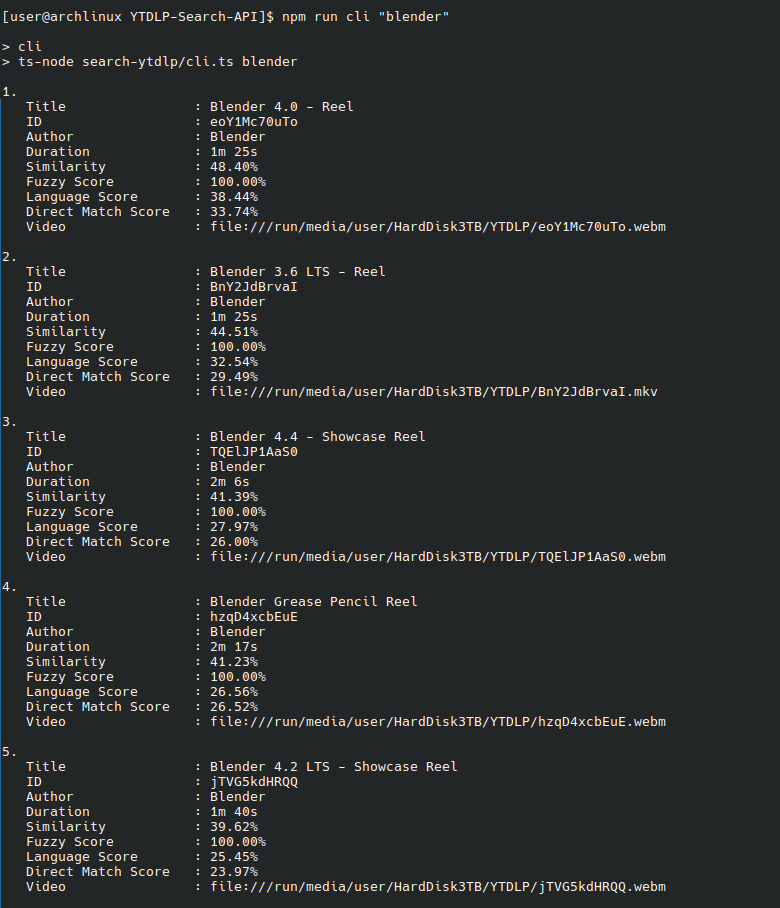

# YTDLP-Search-API

Search tool and API for content downloaded with YTDLP.

> Results feel far better than anything big tech can seem to offer nowadays.

Originally made as an easy way to search my downloaded content with the command line.

This uses a search algorithm I made to easily sort through content, taking into account, the video title, description, author, tags, categories, genres, etc... Includes fuzzy and alike searches too!

The search can easily handle spelling mistakes.



Uses multiple cores and has various search types to allow you to run this on crappy or super-powerful setups.

The API has caching too, so you can reduce load on your CPU and drives if you have a many thousand downloaded things.

# Usage

This tool **requires** your videos to have an **accompanying json metadata file**. You can easily do this by adding `--write-info-json` to your yt-dlp commands. It uses the data from these files to understand which videos are most relevant to your search.

```sh
# yt-dlp.conf
## Save all videos to a specific path e.g: /home/user/yt-dlp-videos/
-o /path/to/where/you/want/to/save/your/files/%(id)s.%(ext)s

## Save the JSON metadata of the video
--write-info-json
```

## Installation

Because this is a Node application, all you need is Node (v16+ should be fine).

```sh
# Clone repository
git clone https://github.com/LiamPerson/YTDLP-Search-API.git
# Define your environment
nano .env
```

Example `.env` file:

```sh
# Where your YTDLP videos are stored. Same as above in your yt-dlp.conf
YTDLP_DIRECTORY='/path/to/your/videos/'
# The port you want to serve the API
PORT=5020
```

```sh
# Install dependencies
npm install
```

## Searching via command line interface

```sh
# Search for your desired
npm run cli "what you want to search for"
```

## Searching via API

The port used is whatever you define in your `.env` file.

```sh
# Run API
npm run api
```

# Options

Both the API and command line searches have options to help you search better. The API uses GET query parameters (e.g: `r=10`) and the command line interface uses flags (e.g: `-r`).

| option    | cli flag | api parameter | description                                      | values                                                                                                                                                                                                           |
| --------- | -------- | ------------- | ------------------------------------------------ | ---------------------------------------------------------------------------------------------------------------------------------------------------------------------------------------------------------------- |
| cores     | `-c`     | `c`           | How many cores you want to use for the operation | any positive number above 0                                                                                                                                                                                      |
| directory | `-d`     | `d`           | The directory where your videos are              | A string specifying the directory                                                                                                                                                                                |
| results   | `-r`     | `r`           | How many results you want to get back            | any positive number above 0                                                                                                                                                                                      |
| sort      | `-s`     | `s`           | What algorithm to use for your search            | `fuzzy` = uses similar words, `language` = uses natural language processing to determine best fit, `normal` = uses both fuzzy and natural language to varying degrees (recommended), `random` = literally random |
